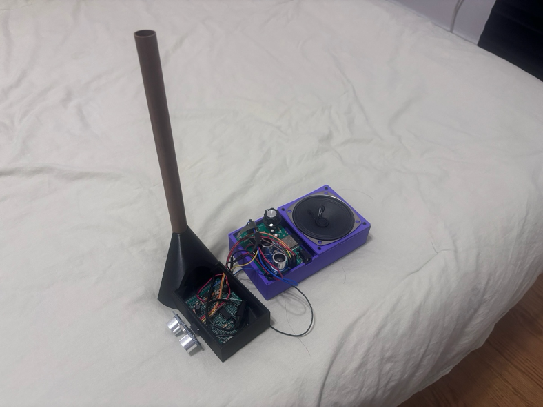
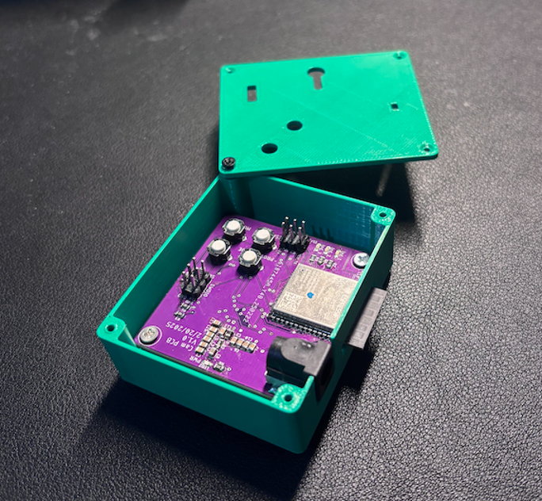
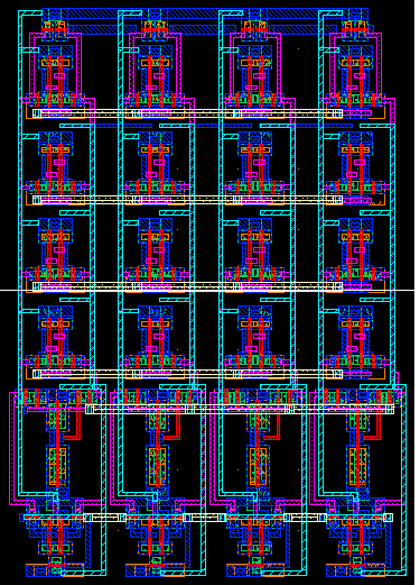
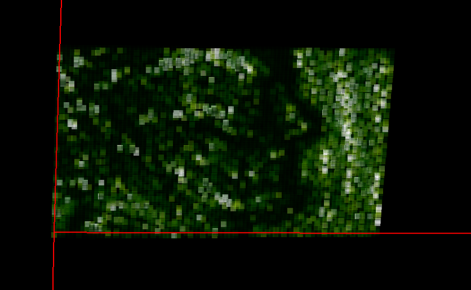

# Ritvik Karra – Electrical Engineer Portfolio

I specialize in **analog electronics, with experience in optical, RF, and audio systems**. I’m a hands-on engineer who loves building and taking ownership of my work. This portfolio features images/details on my projects. 

---

## 📂 Project Gallery

| Project | Description | Skills, Tools & Technologies |
|---------|-------------|--------------|
| **[Synthesizer Project](projects/01-synthesizer/README.md)** | A completely digital, user-friendly, handheld synthesizer made for beginners to understand the fundamentals of electronic sounds. | Sound generation, real-time control & signal processing |
|    **[Theremin Project](projects/02-multimodal-theremin/README.md)** | A theremin (non-contact musical instrument) which features a digital _and_ analog sensing modality, which can be switched between in a custom webpage. | Capacitive sensing, web interface, analog design, I2S, I2C |
|    **[Livestreaming Webcam](projects/03-livestream-webcam/README.md)** | Atmel SAM4S8B powered design that captures and livestreams images to a custom website. | Image processing, I2C, UART, SPI |
|    **[VLSI Design](projects/04-VLSI-design/README.md)** | Designed a 6T SRAM cell and multiple logic standard cells, performing schematic capture, layout, DRC/LVS checks, and timing verification.  | CMOS analog/digital design, Cadence Virtuoso, SPICE simulation, transistor sizing, parasitic extraction, timing analysis |
|    **[Optical Coherence Tomography](projects/05-optical-coherence-tomography/README.md)** | Optimized performance of imaging system using Swept-Source Optical Coherence Tomography to test a novel photodetector. | Optical bench,  C#-based image processing, MATLAB for image visualization, device physics |
|    **[Lacrosse Goalkeeper](projects/06-lacrosse-goalkeeper-robot/README.md)** | Part of a team that built an autonomous Lacrosse goalkeeper that tracked and saved a ball | Motor control, computer vision, control systems |
---

## 🛠 Skills

- **Programming/Scripting:** C, C++, Python, Bash, C#, MATLAB 
- **Embedded Firmware:** SP32, Raspberry Pi, Arduino, Microchip Studio, FreeRTOS
- **PCB Design:** Altium Designer, EAGLE PCB Design
- **Signal Processing:** MATLAB, Python (NumPy, SciPy)
- **CAD & Simulation:** LTSpice, Verilog, Cadence Virtuoso, OnShape, AutoCAD

---

## 📬 Contact

- **LinkedIn:** [linkedin.com/in/ritvikkarra](https://linkedin.com/in/ritvikkarra)
- **Email:** your.email@example.com
- **GitHub:** [github.com/ritvik-karra](https://github.com/ritvik-karra)

---
