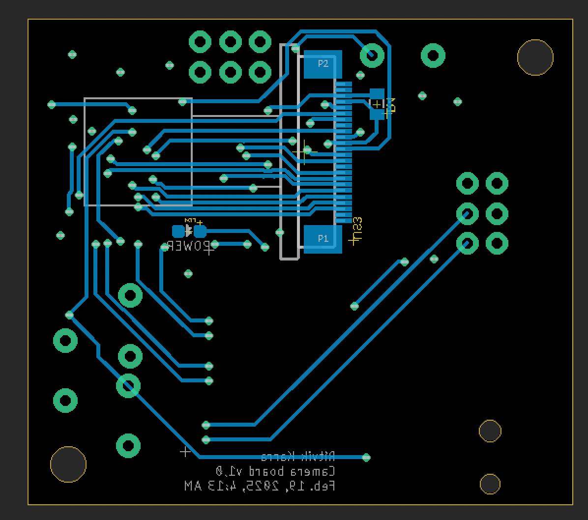
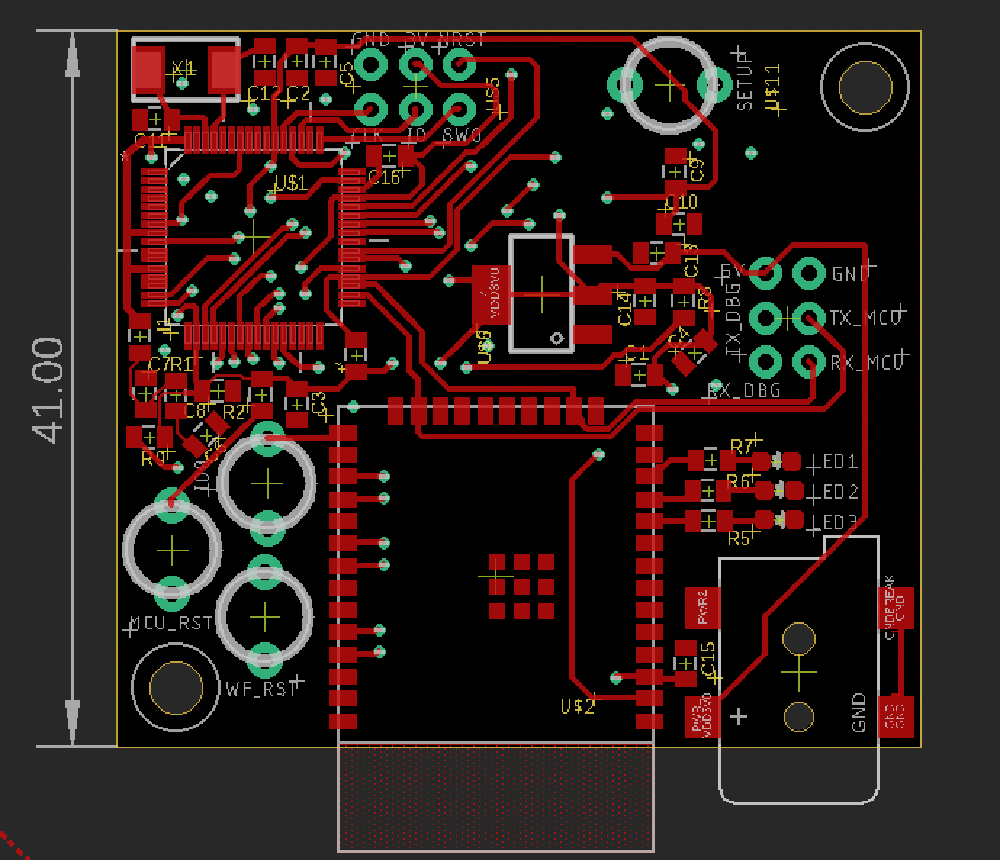
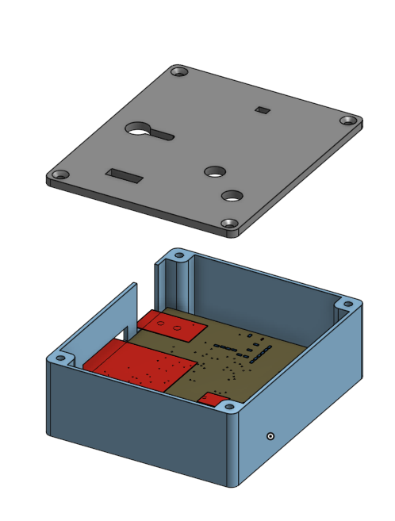

# Custom Webcam with Embedded Web Streaming

## 📖 Overview
This project involved designing a **custom webcam** capable of streaming images to a **custom-built webpage**.  
The system integrates a **camera module**, **microcontroller**, and **Wi-Fi chip** into a compact, custom PCB with a 3D-printed enclosure.

**Main Components:**
- **Camera Module:** OV2640
- **Microcontroller:** Atmel SAM4S8B
- **Wi-Fi Module:** ESP32-WROOM

---

## 🔄 System Data Flow

Camera → Microcontroller → Wi-Fi Module → Webpage

---

### 2. Firmware Development
- Written in **C** for Atmel SAM4S8B
- **Peripheral setup:**
  - UART for ESP32 configuration
  - I²C for camera communication and image transfer to MCU registers
  - SPI for high-speed image transfer from MCU → ESP32 → webpage
- Camera initialization and configuration via I²C
- Main loop handles continuous image acquisition and transmission

### 3. Enclosure Design
- Designed in **Onshape**
  - Camera cutout
  - Power LED visibility
  - Access to control buttons and power jack

---

## 📷 Media
 
 
 

