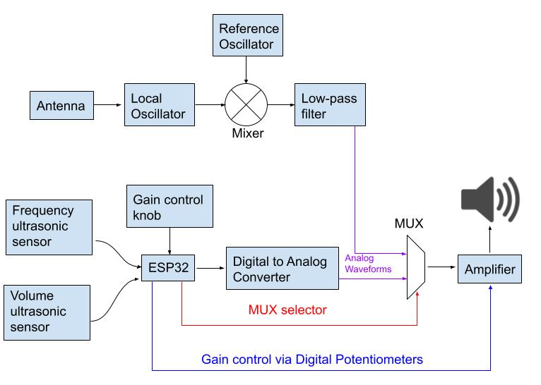
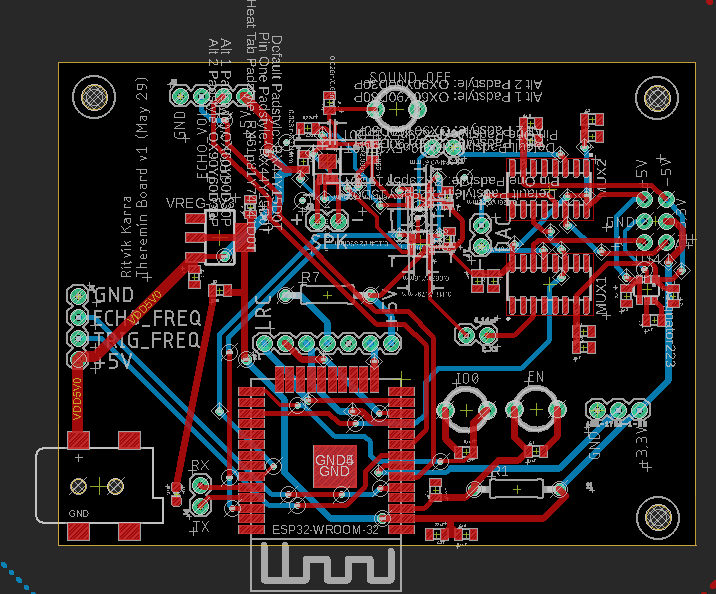

# Multimodal Theremin

## 📖 Overview
The theremin is a musical instrument that can be played without physical contact. A theremin has
2 “antennas”: one which senses the distance between the player’s hand and the antenna to control
the pitch and volume of the sound. Our goal was to build our own modular, multi-modal
theremin (“Hands-Off”) which uses various sensing mechanisms to control pitch and volume.

**Key Components:**
- **Microcontroller + Wi-Fi Module:** ESP32-WROOM

**Sensing Modalities:**  
*Digital* 
- Has 2 ultrasonic sensors which each sense the distance of the players hands from them 
- Wrote a waveform generator into the ESP32 firmware, whose pitch and amplitude is controlled by the distance sensed by the ultrasonic sensors 

*Analog*
- The theremin uses two almost identical LC oscillators that create waves at slightly different frequencies. One is a steady reference, and the other has an antenna connected.  
- When a hand gets near the antenna, it creates a capacitor. As the hand moves, the capacitance changes which shifts the frequency of the second oscillator.  
- Both signals are cleaned up and sent to a mixer circuit that combines them.  
- The mixer creates a new signal based on the difference between the two frequencies, which is then low-pass filtered into the human hearing range.  
- This final signal is sent to the main board to be amplified and played, so small hand movements cause noticeable changes in pitch.

**System** 

- The main board has two multiplexers that switch between analog and digital audio signals. Analog cicuitry was made on a separate perf board -- the analog output from the perf board are supplied to the main PCB via jumpers. 
- The user selects the mode via a website interface, which controls the multiplexers.  
- When set to analog, the multiplexers pass signals from the analog theremin.  
- When set to digital, they pass signals generated by the ESP32’s DAC/amplifier.  
- The chosen signal is sent to an audio amplifier that drives the speaker.  
- The amplifier needs carefully matched gain resistors, so I2C digital potentiometers controlled by the ESP32 adjust the gain. 
- A physical potentiometer on the board sends signals to the ESP32, which controls the I2C digital potentiometers, which both have the same control line such that their resistances are always matched. 
---

## 🔄 Block Diagram

 

---

## 📷 Media
 
 
 

---