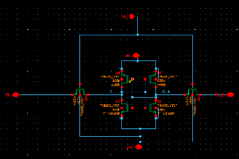
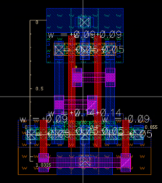
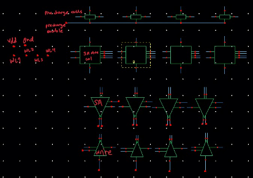
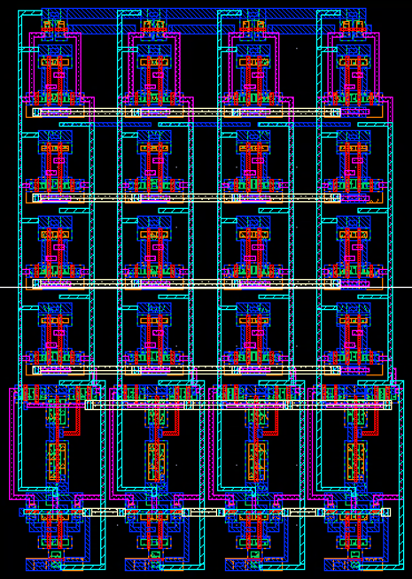
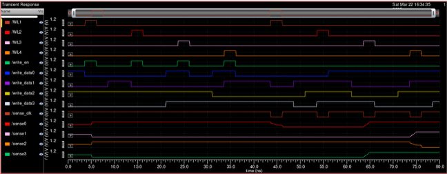

# VLSI Design

## 📖 Overview

Made a standard cell library of digital components such as basic logic gates, and also a 6T SRAM cell as a part of coursework. Conducted LVS, DRC, and parasitic extractions, as well as static timing analysis. 

## 6T SRAM Single Cell

### Schematic 

### Layout 

## 6T SRAM 4x4 Bank

### Schematic 

### Layout 

## Simulation Waveforms with Extracted Parasitics

