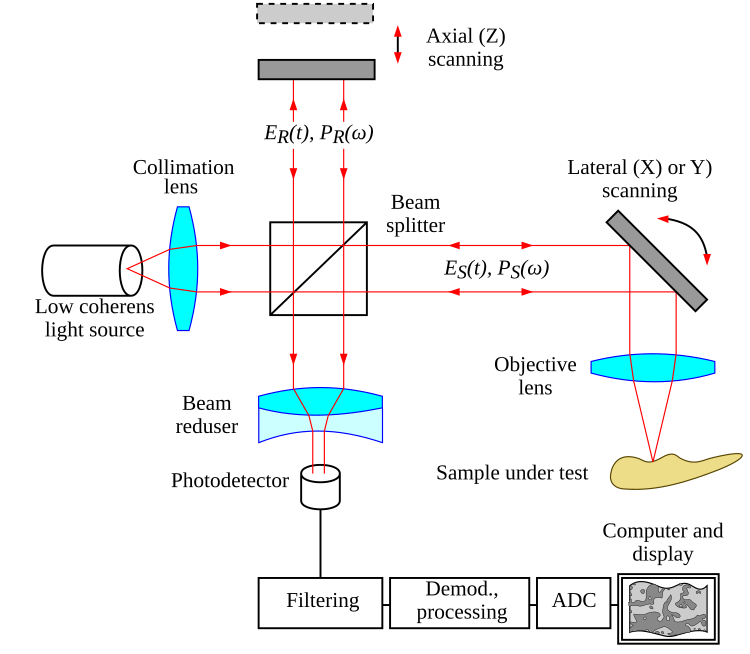

# Optical Coherence Tomography 

## Overview 

- Optical Coherence Tomography (OCT) is a non-invasive imaging technique used to capture 3-D images, typically of biological samples. Its ability to capture detail in 3-D while being non-invasive makes it a useful tool in biological contexts such as ophthalmology, where OCT can be used to diagnose retinal diseases. For this project, we I used a swept-source laser to operate the OCT system – hence the abbreviation SS-OCT. 
- The setup consists of a swept-source laser (a laser that emits varying wavelengths of light periodically), a series of lenses, a photodetector, and a Data Acquisition (DAQ) Device  which is connected to a desktop computer.
- The OCT system itself is setup as depicted below. This is very similar to the setup of a Michelson interferometer. 

## OCT System (source: wikipedia)

- My work focused on characterizing an electron-injection photodetector, comparing its performance to that of a standard photodetector by capturing images from the system. 
- I imaged various samples, such as pennies and onion skins, during my work in the lab. I also improved data acquisition code, characterized the systems power with various photodetectors, and assisted with optical simulations of the system. 
- Some of my work also included 3-D printing parts for the system to improve its stability. 

[Related reading](https://pubmed.ncbi.nlm.nih.gov/28446793/) from the [Bio-Inspired Sensors and Optoelectronics Laboratory(https://bisol.northwestern.edu/)], where I conducted this research.
